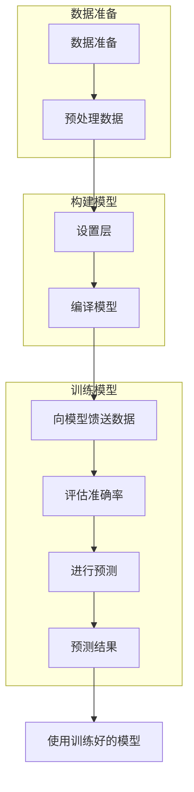

# TensorFlow

## 训练流程

### 数据集准备

* ​	预处理数据

###  构建模型

* 设置层
* 编译模型

### 训练模型

* 模型测试
* 评估准确率
* 进行预测
* 验证预测结果

### 使用训练模型

## 知识补充

###  限制与0-1的原因

>  统一坐标系使用

### 损失函数与梯度下降	

损失函数：由于衡量结果与实际的偏差

梯度下降：根据损失函数对模型变量进行变化

> https://www.cnblogs.com/pinard/p/5970503.html

> 衡量偏差的函数，常用的损失函数有哪些？

* BGD-批量梯度下降法
* SGD-随机梯度下降法
* MBGD-小批量梯度下降法
* ADAM

## 卷积神经网络

 TensorFlow的卷积神经网络都是基于Y=Kx+b的参数进行训练

